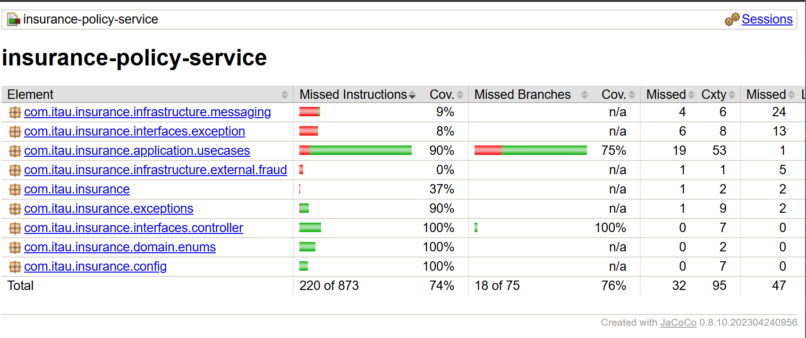

# Insurance Policy Service

Este projeto foi desenvolvido como parte do desafio técnico do Itaú para vaga de Software Engineer. Ele simula um serviço completo de gestão de apólices de seguro, com arquitetura em camadas, integração com mensageria (RabbitMQ) e testes automatizados.

---

## 🧱 Arquitetura

O projeto segue uma estrutura baseada em DDD e Clean Architecture, com separação em:

- **Domain**: enums e regras de negócio
- **Application**: `UseCases` com lógica de orquestração
- **Infrastructure**: acesso a dados, mensageria, clientes externos
- **Interfaces**: controladores REST e DTOs

---

## 🚀 Funcionalidades

- Criar uma apólice (`POST /policies`)
- Validar apólice via análise de fraude externa (`POST /policies/{id}/validate`)
- Atualizar status com base em evento assíncrono (`POST /events/status`)
- Cancelar apólice (`POST /policies/{id}/cancel`)
- Buscar apólice por ID (`GET /policies/{id}`)
- Buscar apólice por cliente (`GET /policies/customer/{customerId}`)

---

## 📨 Mensageria (RabbitMQ)

- Evento é publicado após criação/atualização de apólice
- EventConsumer escuta fila `policy.queue` e atualiza status com base em `paymentConfirmed` e `subscriptionAuthorized`

---

## 🧠 Regras de negócio

- Status inicial: `RECEIVED`
- Validação de apólice depende da classificação de risco:
    - `REGULAR`, `HIGH_RISK`, `PREFERENTIAL`, `NO_INFORMATION`
    - Valor segurado + Categoria (VIDA, AUTO, RESIDENCIAL, etc)
- Status finais: `APPROVED`, `REJECTED`, `CANCELLED`
- Cancelamento só é permitido para status não-finais

---

## ✅ Testes automatizados

- Testes unitários para todos os `UseCases` e `Controllers`
- Cobertura de:
    - Fluxos positivos e negativos
    - Exceções (`PolicyCreationException`, `PolicyNotFoundException`, etc)
    - Regras de negócio detalhadas (`shouldApprove`)
- Cobertura alta (>90%)

---

## ⚠️ Tratamento de erros

- `GlobalExceptionHandler` mapeia exceções para JSON amigável
- Mensagens claras para erros de negócio, falhas de infraestrutura e validações

---

## 🐳 Docker

```bash
docker-compose up -d
```

Serviços:
- RabbitMQ: http://localhost:15672 (user/pass: guest/guest)
- JSON Server (mock de fraude): http://localhost:3001/fraud

---

## 📘 Documentação Swagger

Após rodar o projeto:

```
http://localhost:8080/swagger-ui/index.html
```

---

## 🧪 Testando com cURL / Postman

```bash
# Criar apólice
curl -X POST http://localhost:8080/policies -H "Content-Type: application/json" -d '{ ... }'

# Validar apólice
curl -X POST http://localhost:8080/policies/{id}/validate

# Atualizar status via evento
curl -X POST http://localhost:8080/events/status -H "Content-Type: application/json" -d '{
  "id": "...",
  "paymentConfirmed": true,
  "subscriptionAuthorized": true
}'
```

---

## 🧠 Observações finais

- Projeto foi construído com foco em clareza, separação de responsabilidades e cobertura total dos critérios do PDF do desafio.
- Caso queira rodar testes: `./mvnw test`

---

## 📂 Tecnologias

- Java 17
- Spring Boot 3.x
- JUnit + Mockito
- Docker Compose (RabbitMQ, JSON Server)
- Lombok, MapStruct (opcional)

---

## Cobertura de Testes


